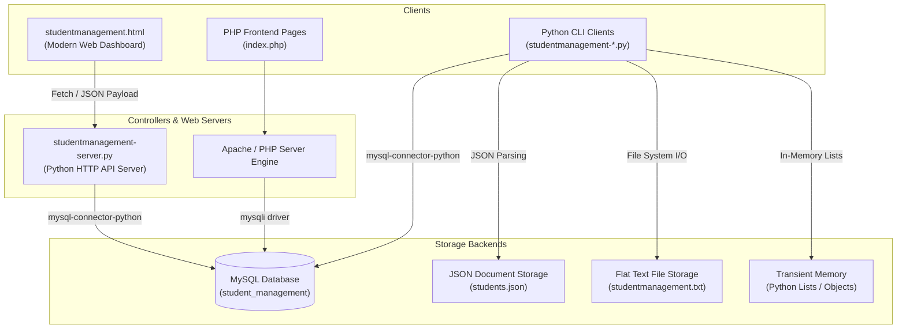

# GradeSync — Student Grade Management & Analytics System

GradeSync is a multi-backend, multi-interface student grade management system developed during my software internship at **IBaseIT**. The project serves as an architectural demonstration of various data persistence strategies (ranging from transient in-memory lists to structured MySQL schemas) exposed via both command-line interfaces (CLI) and responsive web dashboards.

---

## 🏷️ Repository Tags & Topics

Here are the primary tech stack tags and topics associated with this repository:

`student-management-system` · `grade-tracker` · `python-server` · `php-interface` · `mysql-database` · `data-persistence` · `oop-design` · `glassmorphism-dashboard` · `javascript-fetch`

---


## 🏗️ System Architecture

The following diagram illustrates how clients interact with different data models and server controllers in GradeSync:



---

## 🌟 Key Features

1. **Flexible Persistence Engine**:
   - **Object-Oriented**: Run-time model using Python classes and object lists.
   - **Flat File**: CSV-like string splitting/writing to local flat files.
   - **Structured JSON**: Document serialization for persistent configurations.
   - **Relational SQL**: Full database lifecycle management using structured tables and indexing.
2. **Modern Analytics Frontend**:
   - A fully redesigned glassmorphism dashboard built with raw HTML, JavaScript, and custom HSL-themed CSS.
   - Asynchronous fetch APIs for fetching student registry, adding records via JSON POST endpoints, and calculating real-time averages.
3. **Comprehensive PHP Interface**:
   - A complete procedural PHP interface using mysqli connection pools for traditional LAMP/WAMP deployments.
4. **Automated Logging**:
   - Built-in logging module recording server connections, student addition logs, and system exceptions with detailed timestamps.

---

## 📂 Repository File Guide

Only the core components listed below are tracked. Local cache databases, diagnostic logging output, and scrap python scripts are excluded via `.gitignore` to keep the repository clean.

```
├── .gitignore                      # Excludes cache files, logs, and scratchpad scripts
├── README.md                       # Repository overview and setup guide
│
├──── [Web Frontend & Python Server]
│   ├── studentmanagement.html      # Glassmorphism HTML dashboard
│   ├── studentmanagement.css       # Premium CSS styles (HSL gradients, grid systems)
│   ├── studentmanagement.js        # Form validation and asynchronous API integrations
│   └── studentmanagement-server.py # Self-contained HTTP API & static file web server
│
├──── [PHP Frontend Version]
│   ├── index.php                   # Portal homepage
│   ├── add_student.php             # Student creation form
│   ├── display_students.php        # Tabular student viewer
│   ├── class_average.php           # Class performance analytics
│   └── studentmanagement.php       # Form execution helper script
│
├──── [Data Model CLI Drivers]
│   ├── studentmanagement-class.py  # Run-time memory model (RAM)
│   ├── studentmanagement-files.py  # Local text file model (.txt)
│   ├── studentmanagement-json.py   # Local JSON storage model (.json)
│   └── studentmanagement-sql.py    # Direct interactive MySQL model (SQL)
│
└──── [Database Schemas]
    └── studentmanagement.sql       # Database schema initialization script
```

---

## 🛠️ Installation & Setup

### Prerequisites
- Python 3.x
- PHP 7.4+ / Apache Server (e.g. XAMPP, WampServer)
- MySQL Server (version 8.0+)
- Python Packages:
  ```bash
  pip install mysql-connector-python simplejson
  ```

### Database Schema Setup
1. Log into your local MySQL CLI shell or phpMyAdmin.
2. Run the database initialization script:
   ```sql
   source studentmanagement.sql;
   ```
3. *(Optional)* Update the database credentials (`host`, `user`, `password`, `database`) in `studentmanagement-server.py`, `studentmanagement-sql.py`, and the corresponding PHP files if they differ from the default.

---

## 🚀 Usage Guide

### 1. Launching the Web Dashboard (Python & JS)
To start the self-contained Python web server:
```bash
python studentmanagement-server.py
```
Open your browser and navigate to **`http://localhost:8080`**. You can add new student profiles, view the registry list, and compute average grades instantly.

### 2. Launching the PHP Application
1. Copy or clone this folder into your local web root directory (e.g., `C:\xampp\htdocs\` or `C:\wamp64\www\`).
2. Start Apache and MySQL services in your management console.
3. Open your browser and navigate to **`http://localhost/Assignment-1/index.php`**.

### 3. Testing CLI Drivers
To test any of the data storage strategies directly inside a terminal window, run the respective script:
```bash
python studentmanagement-class.py
python studentmanagement-files.py
python studentmanagement-json.py
python studentmanagement-sql.py
```

---

## 👥 Contributors & Collaborators

- **Anisha Paturi** ([GitHub Profile](https://github.com/AnishaPaturi)) — Owner & Lead Developer
- **Yash** — Contributor / Developer

